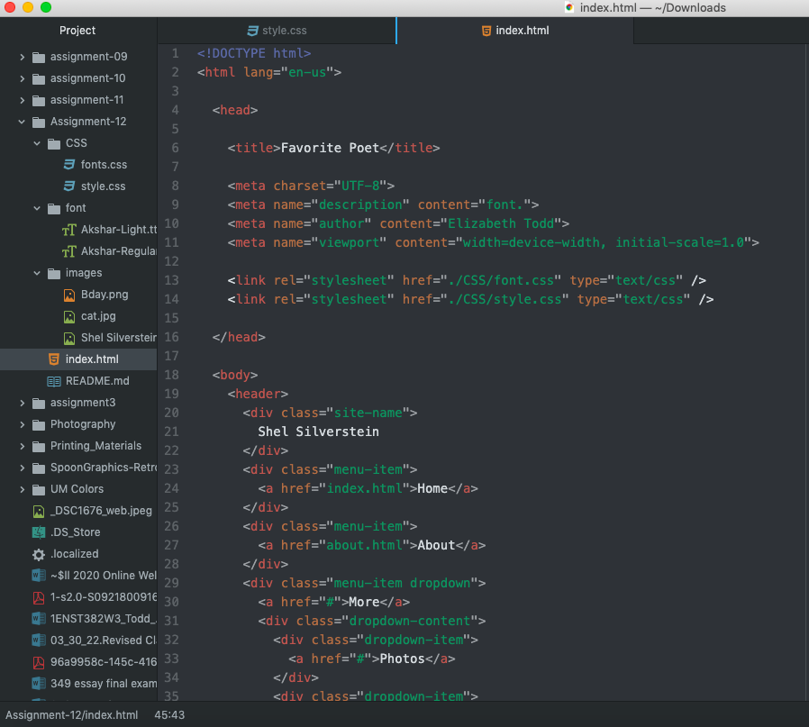

The difference between padding, margin, and borders is how space is added and how the element fits with other elements. Padding is the work of changing the size of individual boxes. Padding on a website increases the area around elements to be larger then the element itself. Margin is the space between the elements and other elements. The padding adds space between an element and its border. The border can be added to the top, right, bottom, and left. The border has multiple style options including width, style, and color which makes it different from padding and margin. 

This week's assignment went fine, I had some issues with last weeks project which I chose to use for this week so figuring out where I went wrong, correcting those mistakes, and ensuring I did everything right this week was a challenge. I think the hardest thing was trying to decipher why things wouldn't work when I changed the styling which was mostly due to messing up on using a colon or semi colon, spelling, or other small things. Taking my time and checking my work helped a lot with this.

