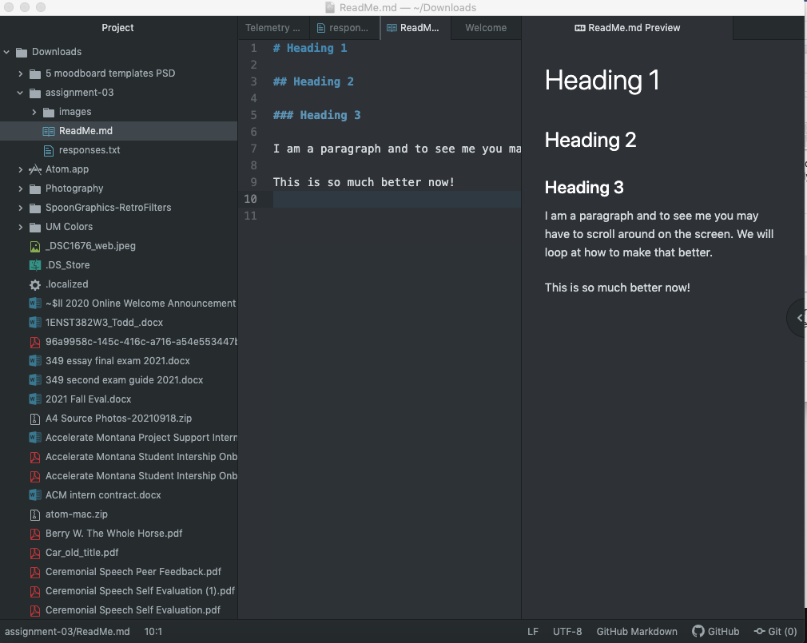

# Heading 1

## Heading 2

### Heading 3

I am a paragraph and to see me you may have to scroll around on the screen. We will loop at how to make that better.

This is so much better now!

[Course Website](https://montana-media-arts.grithub.io/314-web-design)

[My Responses](./responses.txt)

I have learned a lot in this course including what error messages really mean, like "404 Page not Found" and how to fix how you search for things.
I have also learned about the creation and founding of the internet which was extremely interesting to learn about. To hear from the founder of the internet about the process and power of the internet, it was very eye opening.
Also, I learned about the true purpose of wires, cables, and wifi, and their function in supplying internet to people and connecting the world.
