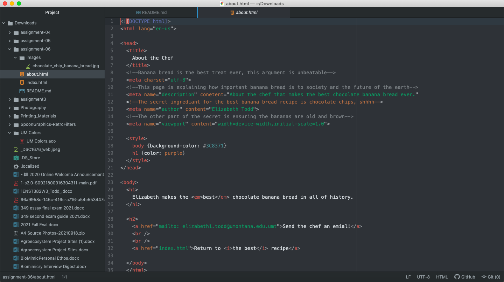

The difference between structural and semantic markup is the way the reader understands information. Structural markup creates the structure of a document like paragraphs, headings, and lists. On the other hand, semantic markups give information meaning like bolding, striking through, italicizing, and more. This allows the reader to see what the writer wants to be clearly understood and the more important pieces of information. 

