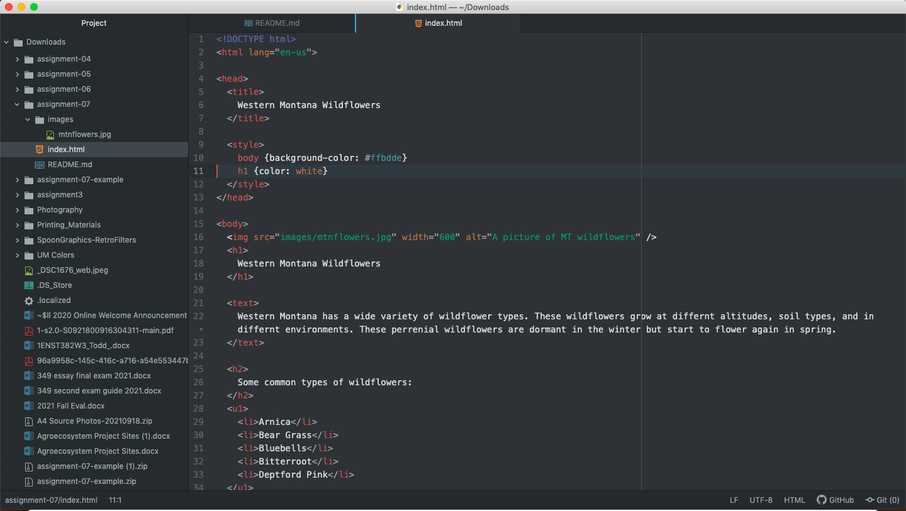

 Some forms that I have come across while browsing the web include logging into sites. This is protecting people from accessing my personal information. This includes passwords, my phone number, and a personalized username. I have also used recently a feedback form where after I answered a question a certain way, Yes or No, there was a drop down box that asked why I chose one of the other. I have used a search and submit button a lot on sites like Google, YouTube, Moodle, and more. 

