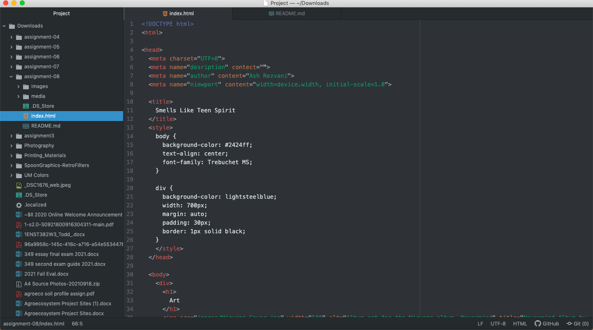

An affordance is an action possibility on a website. These are buttons, interactive spaces, and places where the user can do "something" to the website. An affordance can look like a "Home Button" or a search button.
The advantages of using a third-party service like YouTube or Vimeo is that they are affordable and have a wide variety of files. Additionally can host audio and video files which is really helpful.
But, the disadvantages of using a third-party service is that they are copyrighted and private. Some videos can't be embedded and used and these sites can not be used for images and are costly at times.
Some challenges I faced this week is having some spelling error or small mistakes that messed up everything. This was extremely frustrating to try and fix and understand what I did wrong. I figured it out and still had fun!

