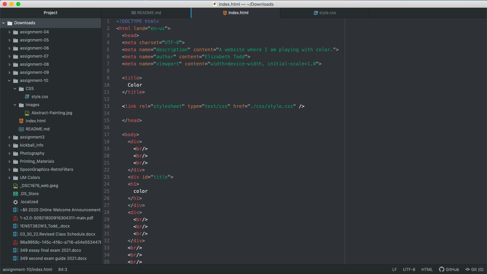

The universal selector is used to style every element on a page. Element selectors is used to select all elements of a certain type. It is applied by using an element name. Class selector selects elements that serve the same function. Finally id selectors are used to define rules for a specific elements. I would choose the class selectors to apply to certain elements that are being used the same way. This will make a seamless and styled website that flows together.

I choose my color palette by analyzing the painting by Wassily Kandinsky. It is called Untitled and is the first abstract watercolor painting. It was done in 1913 and is so beautiful. I love the collage of colors and this image.

