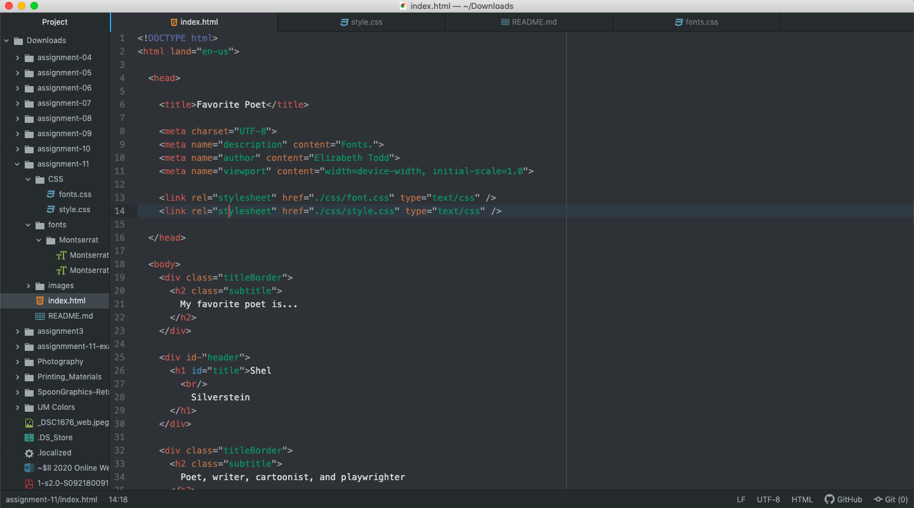

Typography is the technique of making language appealing and readable through organizing information well.

The importance of having fallback fonts or a font stack is so that when a page is loading and switches fonts, it will not be surprising to the reader/viewer. This allows the viewer to adjust to the page loading.

The difference between a system font, web font, and web-safe font is their ability to be used on the web. System fonts are those fonts already available but are not set up for the web. Web fonts are custom fonts hosted on a server that are more efficient for the web. Web-safe fonts include Times New roman and Arial that are available by devices and can be easily used on the web.

